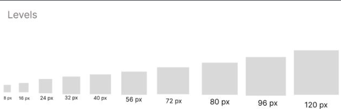

 

<h1 style="text-align: center;"> Informe del Trabajo Final </h1>
<h3 style="text-align: center;"> Universidad Peruana de Ciencias Aplicadas </h3>
 
alt="Logo UPC"
style="display: block; 
margin-left:auto; 
margin-right: auto; 
width=30%"/>

<h5 style="text-align: center">UNIVERSIDAD PERUANA DE CIENCIAS APLICADAS</h5>

<h5 style="text-align: center">CARRERA :</h5>

Ingeniería de Software y Ciencias de la Computación

<h5 style="text-align: center">CICLO</h5>

2025-02

<h5 style="text-align: center">CURSO</h5>

<h5 style="text-align: center">SECCIÓN</h5>

<h5 style="text-align: center">DOCENTE</h5>

<h5 style="text-align: center">Grupo</h5>

<h5 style="text-align: center">PRODUCTO</h5>

<h5 style="text-align: center">2025</h5>

## Team members:
| Nombre |Código|
|:-------:|:----------:|
|-|-|
|-|-|
|-|-|
|-|-|
|-|-|

  

## Registro de versiones del informe

|Versión|Fecha|Autor|Descripción de modificación|
|:-:|:-:|:-:|:-:|
|TB1|||Creación del documento de trabajo en formato markdown, capítulo I, capítulo II, capítulo III, capítulo IV y capítulo V    |

  

## Project Report Collaboration Insights

Enlace de la organización para el reporte del proyecto: 

**TB1**

Para el desarrollo del informe correspondiente a la entrega TB1, se estableció la implementación de secciones de la siguiente manera para cada integrante del equipo:

|Integrante|Tareas Asignadas|
|-|-|
|-|-|
|-|-|
|-|-|
|-|-|

El proceso de colaboración en el informe se realizó mediante commits constantes al repositorio de la organización.

 

## **Github Collaboration Insights**

Los integrantes son:

* 
* 
* 
* 
* 

(**Especifiquen los usuarios**)

(Fotos)

## Contenido

[**Capítulo I: Introducción.**](#1)  
    1.1. [Startup Profile](#11)  
    &emsp;1.1.1. [Descripción de la Startup](#111)  
    &emsp;1.1.2. [Perfiles de integrantes del equipo](#112)  
   1.2. [Solution Profile](#12)  
   &emsp;1.2.1. [Antecedentes y problemática](#121)  
   &emsp;1.2.2. [Lean UX Process](#122)  
   &emsp;&emsp;1.2.2.1. [Lean UX Problem Statements](#1221)  
   &emsp;&emsp;1.2.2.2. [Lean UX Assumptions](#1222)  
   &emsp;&emsp;1.2.2.3. [Lean UX Hypothesis Statements](#1223)  
   &emsp;&emsp;1.2.2.4. [Lean UX Canvas](#1224)  
   1.3. [Segmentos objetivo](#13)  

[**Capítulo II: Requirements Elicitation & Analysis.**](#2)  
   2.1. [Competidores](#21)  
   &emsp;2.1.1. [Análisis competitivo](#211)  
   &emsp;2.1.2. [Estrategias y tácticas frente a competidores](#212)  
   2.2. [Entrevistas](#22)  
   &emsp;2.2.1. [Diseño de entrevistas](#221)  
   &emsp;2.2.2. [Registro de entrevistas](#222)  
   &emsp;2.2.3. [Análisis de entrevistas](#223)  
   2.3. [Needfinding](#23)  
   &emsp;2.3.1. [User Personas](#231)  
   &emsp;2.3.2. [User Task Matrix](#232)  
   &emsp;2.3.3. [User Journey Mapping](#233)  
   &emsp;2.3.4. [Empathy Mapping](#234)  
   &emsp;2.3.5. [As-is Scenario Mapping](#235)  
   2.4. [Ubiquitous Language](#24)  

[**Capítulo III: Requirements Specification.**](#3)  
   3.1. [To-Be Scenario Mapping](#31)  
   3.2. [User Stories](#32)  
   3.3. [Impact Mapping](#33)  
   3.4. [Product Backlog](#34)  

[**Capítulo IV: Product Design.**](#4)  
   4.1. [Style Guidelines](#41)  
   &emsp;4.1.1. [General Style Guidelines](#411)  
   &emsp;4.1.2. [Web Style Guidelines](#412)  
   4.2. [Information Architecture](#42)  
   &emsp;4.2.1. [Organization Systems](#421)  
   &emsp;4.2.2. [Labeling Systems](#422)  
   &emsp;4.2.3. [SEO Tags and Meta Tags](#423)  
   &emsp;4.2.4. [Searching Systems](#424)  
   &emsp;4.2.5. [Navigation Systems](#425)  
   4.3. [Landing Page UI Design](#43)  
   &emsp;4.3.1. [Landing Page Wireframe](#431)  
   &emsp;4.3.2. [Landing Page Mock-up](#432)  
   4.4. [Web Applications UX/UI Design](#44)  
   &emsp;4.4.1. [Web Applications Wireframes](#441)  
   &emsp;4.4.2. [Web Applications Wireflow Diagrams](#442)  
   &emsp;4.4.3. [Web Applications Mock-ups](#443)  
   &emsp;4.4.4. [Web Applications User Flow Diagrams](#444)  
   4.5. [Web Applications Prototyping](#45)  
   4.6. [Domain-Driven Software Architecture](#46)  
   &emsp;4.6.1. [Software Architecture Context Diagram](#461)  
   &emsp;4.6.2. [Software Architecture Container Diagrams](#462)  
   &emsp;4.6.3. [Software Architecture Components Diagrams](#463)  
   4.7. [Software Object-Oriented Design](#47)  
   &emsp;4.7.1. [Class Diagrams](#471)  
   &emsp;4.7.2. [Class Dictionary](#472)  
   4.8. [Database Design](#48)  
   &emsp;4.8.1. [Database Diagram](#481)  

[**Capítulo V: Product Implementation, Validation & Deployment.**](#5)  
   5.1. [Software Configuration Management](#51)  
   &emsp;5.1.1. [Software Development Environment Configuration](#511)  
   &emsp;5.1.2. [Source Code Management](#512)  
   &emsp;5.1.3. [Source Code Style Guide & Conventions](#513)  
   &emsp;5.1.4. [Software Deployment Configuration](#514)  
   5.2. [Landing Page, Services & Applications Implementation](#52)  
   &emsp;5.2.1. [Sprint 1](#521)  
   &emsp;&emsp;5.2.1.1. [Sprint Planning 1](#5211)  
   &emsp;&emsp;5.2.1.2. [Sprint Backlog 1](#5212)  
   &emsp;&emsp;5.2.1.3. [Development Evidence for Sprint Review](#5213)  
   &emsp;&emsp;5.2.1.4. [Testing Suite Evidence for Sprint Review](#5214)  
   &emsp;&emsp;5.2.1.5. [Execution Evidence for Sprint Review](#5215)  
   &emsp;&emsp;5.2.1.6. [Services Documentation Evidence for Sprint Review](#5216)  
   &emsp;&emsp;5.2.1.7. [Software Deployment Evidence for Sprint Review](#5217)  
   &emsp;&emsp;5.2.1.8. [Team Collaboration Insights during Sprint](#5218)  
   

6. [**Conclusiones**](#conclusiones)

7. [**Bibliografía**](#bibliografia)

8. [**Anexo**](#anexo)

## Student Outcome
El curso contribuye al cumplimiento del Student Outcome ABET:  
**ABET – EAC - Student Outcome 3**

**Criterio:** Capacidad de comunicarse efectivamente con un rango de audiencias. En el siguiente cuadro se describen las acciones realizadas y enunciados de conclusiones por parte del grupo, que permiten sustentar el haber alcanzado el logro del ABET – EAC - Student Outcome 3.

 

| **Criterio específico**| **Acciones realizadas**| **Conclusiones**|
|--|--|--|

 

# Capítulo I: Introducción

## 1.1. Startup Profile
### 1.1.1. Descripción de la Startup
### 1.1.2. Perfiles de integrantes del equipo

## 1.2. Solution Profile
### 1.2.1. Antecedentes y problemática
### 1.2.2. Lean UX Process
#### 1.2.2.1. Lean UX Problem Statements
#### 1.2.2.2. Lean UX Assumptions
#### 1.2.2.3. Lean UX Hypothesis Statements
#### 1.2.2.4. Lean UX Canvas

## 1.3. Segmentos objetivo

# Capítulo II: Requirements Elicitation & Analysis

## 2.1. Competidores
### 2.1.1. Análisis competitivo
### 2.1.2. Estrategias y tácticas frente a competidores

## 2.2. Entrevistas
### 2.2.1. Diseño de entrevistas
### 2.2.2. Registro de entrevistas
### 2.2.3. Análisis de entrevistas

## 2.3. Needfinding
### 2.3.1. User Personas
### 2.3.2. User Task Matrix
### 2.3.3. User Journey Mapping
### 2.3.4. Empathy Mapping

## 2.4. Big Picture EventStorming
## 2.5. Ubiquitous Language

# Capítulo III: Requirements Specification

## 3.1. User Stories
## 3.2. Impact Mapping
## 3.3. Product Backlog

# Capítulo IV: Product Design

## 4.1. Style Guidelines

### 4.1.1. General Style Guidelines
### 4.1.2. Web Style Guidelines

## 4.2. Information Architecture
### 4.2.1. Organization Systems
### 4.2.2. Labeling Systems
### 4.2.3. SEO Tags and Meta Tags
### 4.2.4. Searching Systems
### 4.2.5. Navigation Systems

## 4.3. Landing Page UI Design
### 4.3.1. Landing Page Wireframe
### 4.3.2. Landing Page Mock-up

## 4.4. Web Applications UX/UI Design
### 4.4.1. Web Applications Wireframes
### 4.4.2. Web Applications Wireflow Diagrams
### 4.4.3. Web Applications Mock-ups
### 4.4.4. Web Applications User Flow Diagrams

## 4.5. Web Applications Prototyping

## 4.6. Domain-Driven Software Architecture
### 4.6.1. Design-Level EventStorming
### 4.6.2. Software Architecture Context Diagram
### 4.6.3. Software Architecture Container Diagrams
### 4.6.4. Software Architecture Components Diagrams

## 4.7. Software Object-Oriented Design
### 4.7.1. Class Diagrams

## 4.8. Database Design
### 4.8.1. Database Diagrams

# Capítulo V: Product Implementation, Validation & Deployment

## 5.1. Software Configuration Management
### 5.1.1. Software Development Environment Configuration
### 5.1.2. Source Code Management
### 5.1.3. Source Code Style Guide & Conventions
### 5.1.4. Software Deployment Configuration

## 5.2. Landing Page, Services & Applications Implementation
### 5.2.X. Sprint n
#### 5.2.X.1. Sprint Planning n
#### 5.2.X.2. Aspect Leaders and Collaborators
#### 5.2.X.3. Sprint Backlog n
#### 5.2.X.4. Development Evidence for Sprint Review
#### 5.2.X.5. Execution Evidence for Sprint Review
#### 5.2.X.6. Services Documentation Evidence for Sprint Review
#### 5.2.X.7. Software Deployment Evidence for Sprint Review
#### 5.2.X.8. Team Collaboration Insights during Sprint

## 5.3. Validation Interviews
### 5.3.1. Diseño de Entrevistas
### 5.3.2. Registro de Entrevistas
### 5.3.3. Evaluaciones según heurísticas

